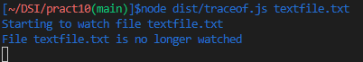

# Práctica 10. Sistema de ficheros y creación de procesos en Node.js
## Introducción.

En esta práctica se plantean una serie de ejercicios o retos a resolver haciendo uso de las APIs proporcionadas por Node.js para interactuar con el sistema de ficheros, así como para crear procesos.

## Ejercicio 1. Traza sobre el flujo de ejecución de un programa.
Se propone hacer la traza de la ejecución del siguiente preograma:
````js
import {access, constants, watch} from 'fs';

if (process.argv.length !== 3) {
  console.log('Please, specify a file');
} else {
  const filename = process.argv[2];

  access(filename, constants.F_OK, (err) => {
    if (err) {
      console.log(`File ${filename} does not exist`);
    } else {
      console.log(`Starting to watch file ${filename}`);

      const watcher = watch(process.argv[2]);

      watcher.on('change', () => {
        console.log(`File ${filename} has been modified somehow`);
      });

      console.log(`File ${filename} is no longer watched`);
    }
  });
}
````
  
Indicando paso a paso el como es el flujo de ejecución a través de la pila de llamadas, el registro de eventos de la API y la cola de manejadores.

Tras la ejecución se observa la salida por consola del programa:  
 

* **Primer Ciclo**  
`Pila de llamada` :  
if (process.argv.length !== 3)

* **Segundo Ciclo**  
`Pila de llamada`:  
const filename = process.argv[2]

* **Tercer Ciclo**  
`Pila de llamadas`:  
access(filename, constants.F_OK, (err)  
if (err)  

* **Cuarto Ciclo**   
`Pila de llamadas`:    
console.log(`Starting to watch file ${filename}`)  
access(filename, constants.F_OK, (err)

 
* **Quinto Ciclo**  
`Pila de llamadas`:  
const watcher = watch(process.argv[2])    
access(filename, constants.F_OK, (err)

* **Sexto Ciclo**  
`Pila de llamadas`: 
 watcher.on('change', () =>  
 access(filename, constants.F_OK, (err) =>

* **Séptimo Ciclo**  
`Pila de llamadas`:  
access(filename, constants.F_OK, (err) =>  

`Registro de eventos`: 
watcher.on('change', () => {

_**NOTA:**_ se procede a realizar una modificación en el fichero pasado en _argv[2]_

* **Ocatvo Ciclo**  
`Registro de eventos`:   
 ````js  
 watcher.on('change', () => {
    console.log(`File ${filename} has been modified somehow`);
  });  
```` 
`Cola de manejadores`:  
() => {console.log('File ${filename} has been modified somehow')  


* **Noveno Ciclo**    
`Pila de llamadas`:  
    console.log('File ${filename} has been modified somehow')  
`Registro de eventos`:  
````js  
watcher.on('change', () => {
  console.log(`File ${filename} has been modified somehow`);
});  
```` 

* **Décimo Ciclo**    
`Registro de eventos`:  
````js  
watcher.on('change', () => {
  console.log(`File ${filename} has been modified somehow`);
});      
````

Aquí sale la salida por consola mostrada anteriormente:

 

### **¿Qué es lo que hace la función `acces`?**
_Acces()_ es un método asínrcono de la `API File System` que prueba los permisos de un usuario para el archivo o directorio especificado por una ruta.   
### **¿Para que sirve el objeto `constants`?**
````js 
export namespace constants {
  // File Access Constants
  /** Constant for fs.access(). File is visible to the calling process. */
  const F_OK: number;
  /** Constant for fs.access(). File can be read by the calling process. */
  const R_OK: number;
  /** Constant for fs.access(). File can be written by the calling process. */
  const W_OK: number;
  /** Constant for fs.access(). File can be executed by the calling process. */
  const X_OK: number;
  // File Copy Constants
  /** Constant for fs.copyFile. Flag indicating the destination file should not be overwritten if it already exists. */
  const COPYFILE_EXCL: number;
  /**
   * Constant for fs.copyFile. copy operation will attempt to create a copy-on-write reflink.
   * If the underlying platform does not support copy-on-write, then a fallback copy mechanism is used.
   */
  {...}
  ````
  En el anterior se muestra algunos ejemplos de las distintas constantes que tiene el objeto _constants_ cada constante representa un entero para el cual el método _acces_ se comportará de distinta forma.

## Ejercicio 2. Número de ocurrencias de una palabra en un fichero.  
Se requiere un programa capaz de contar el número de veces que aparece una palabra en específico.

Para ello se ha creado una clase a la que se le pasa el nombre del fichero donde extraer el número de ocurrencias de una palabra, también la propia palabra a buscar, el método de búsqueda (haciendo uso de  `pipe` o sin el) y un entero que almacenará el número de argumentos a la hora de ejecutar el programa.

````js 
constructor(private filename: string, private wordToFind: string, private grepOption: string, private argNumber: number){
  super();
}
````
### `StartFlow()`
El método principal de la clase es `StartFlow()` el cual hará todas las comprobaciones necesarias para el correcto funcionamiento del programa.
````js
fs.access(this.filename, fs.constants.R_OK, (err) => {
  if(this.grepOption !== 'Pipe' && this.grepOption !== 'noPipe') {
    console.error(chalk.redBright(`No match option for ${this.grepOption}. Try Pipe/noPipe`));
    this.emit('error',`No match option for the find option. Try Pipe/noPipe`);
  }
{...}
````
Se comprueba los permisos del usuario sobre el fichero especificado por la ruta y se mira que tipo de método de búsqueda ha introducido el usuario para ver si es válido.

````js
else if (this.argNumber !== 5) {
  console.error(chalk.redBright("Insufficient number of parameters."));
  this.emit('error',`Insufficient number of parameters`);
}
````
Se comprueba que los argumentos propiciados por el usurio son los necesarios.

````js 
else if(!fs.existsSync(`./${this.filename}`)) {
  console.error(chalk.redBright("Filename does not exist."));
  this.emit('error',`Filename does not exist.`);
}
````
Se comprueba la existencia del fichero.

````js
else if (err) {
  console.error(chalk.redBright(`Cannot access to the file...try again`));
  this.emit('error',`Cannot access to the file...try again`);
} 
````
Para cualquier otro error se emite un evento con un mensaje de error.

Una vez hechas todas las comprobaciones si todo va bien se llama al método de búsqueda interesado.
````js 
else {
  if (this.grepOption === 'Pipe') {
    this.Pipe();
  } else if ( this.grepOption === 'noPipe') {
    this.noPipe();
  } else {
    console.error(chalk.redBright(`No match option for ${this.grepOption}. Try Pipe/noPipe`));
    this.emit('error',`No match option for the find option. Try Pipe/noPipe`);
  }
````
### `noPipe()`
Éste método contará el número de veces que encuentra una palabra en un fichero.

Para ello lo primero se creará un proceso por cada comando que se usará, en este caso dos (_cat_ y _grep_)  
````js   
const cat = spawn("cat", [this.filename]);
const grep = spawn("grep", [this.wordToFind]);
````
Luego la salida del comando cat será la entrada de grep, para ello se usa el método `write` con el `Stream` generado por la salida de cat.   
````js 
cat.stdout.on("data", (data) => {
  grep.stdin.write(data);
});

cat.stdout.on("end", () => {
  grep.stdin.end();
});
````
Se almacena los datos generados por el comando grep.
````js
let catOutput: string = "";
grep.stdout.on("data", (data) => {
  catOutput += data;
});
````

Una vez se tengan todos los datos necesarios se procesa la información y se hace la búsqueda.
````js 
grep.on('close',() => {
  const ocurrence = catOutput.match(new RegExp(`${this.wordToFind}`, "g"));
  let result: string = "";
  if(ocurrence !== null) {
    result = `${this.wordToFind} aparece ${ocurrence} veces`;
    this.emit('ocurrence',result)
    return result;
  } else {
    result = `${this.wordToFind} no se encuentra`;
    this.emit('ocurrence',result)
    return result;
  }
});
````

### `Pipe()`

Éste método es muy parecido al anterior pero al poder usarse el método `pipe` el procesamiento de datos será mucho más sencillo.

````js
const cat = spawn('cat', [this.filename]);
const grep = spawn('grep', [this.wordToFind]);  
````
Ahora simplemente redirigiendo la salida de cat mediante el `pipe` a la entrada de grep quedan comunicados ambos comnados.
````js
cat.stdout.pipe(grep.stdin);
````

Lo siguiente se hace de la misma manera que en el método `noPipe()`  
````js
let catOutput = "";
grep.stdout.on('data', (grepContent) => {
  catOutput += grepContent;
});

grep.on('close', () => {
  const ocurrence = catOutput.match(new RegExp(`${this.wordToFind}`, "g"));
  let result: string = "";
  if(ocurrence !== null) {
    result = `${this.wordToFind} aparece ${ocurrence} veces`;
    this.emit('ocurrence',result)
    return result;
  } else {
    result = `${this.wordToFind} no se encuentra`;
    this.emit('ocurrence',result)
    return result;
  }
});
````

### **Tests**

````js
it ('Method Pipe()',(done) => {
  pipefind.StartFlow();
  pipefind.on('ocurrence', (message) => {
    expect(message).to.be.eql ('test aparece 4 veces');
    done();
  });
});
it ('Method noPipe()',(done) => {
  nopipefind.StartFlow();
  nopipefind.on('ocurrence', (message) => {
    expect(message).to.be.eql ('test aparece 4 veces');
    done();
  });
});
````

## Ejercicio 3. Watcher Notes.

Se ha creado una clase que hereda `EventEmitter` para el control de eventos.
  
### `watchDirectory()`
Se le pasa como argumentos tanto el usuario como el directorio y éste devuelve un objeto `FSWatcher` y estará observando cualquier cambio en el directorio de un usaurio.  
````js
 watchDirectory(user: string, directory: string): FSWatcher {...}
````

Éste método gracias a la función asícrona de la API File System `whatch` se queda en espera observando cualquier posible cambio dentro de la ruta a la que está apuntando.
**`Manejadores`**
`Rename` se encargará de mostrar cuando cualquier elemento del directorio ha sido eliminado. 
````js
fswatcher.on('rename', (filename) => {
  console.log(`${filename} has been removed`);
  this.emit('rename', `The note ${filename} has been removed`);
});
````
 `Change` se encargará de mostrar cuando cualquier elemento del directorio ha sido modificado. 
````js
fswatcher.on('change', (filename) => {
  console.log(`${filename} has changed`);
  this.emit('change', `${filename} has changed`);
});
````